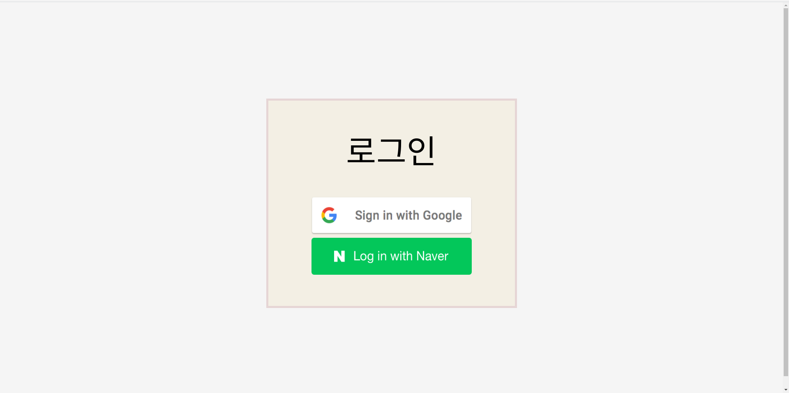
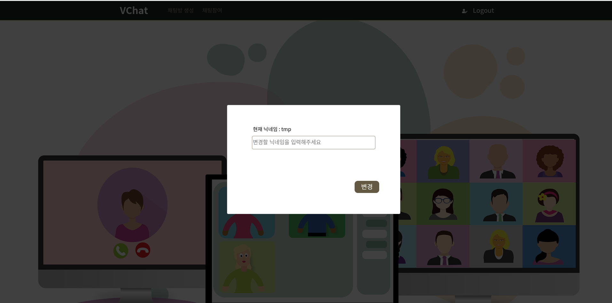
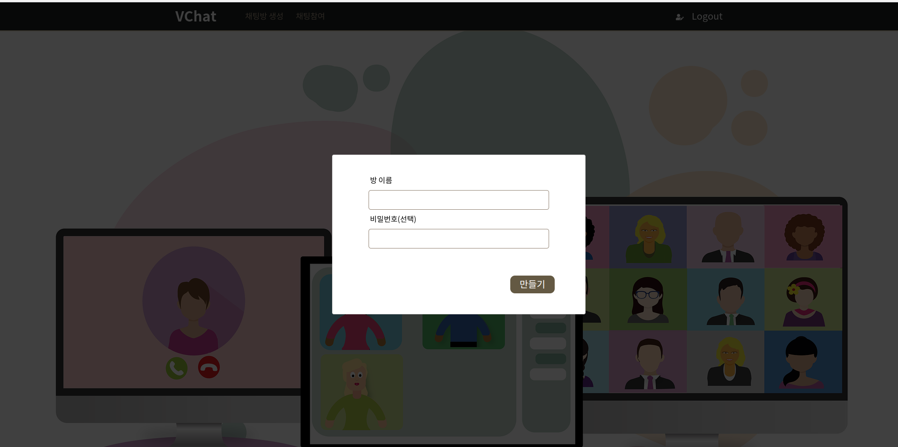
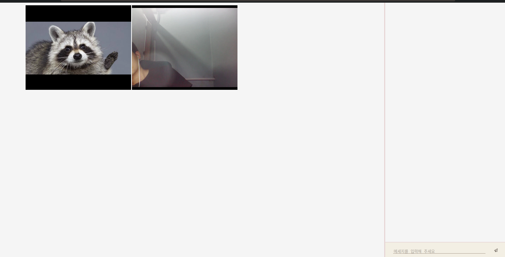
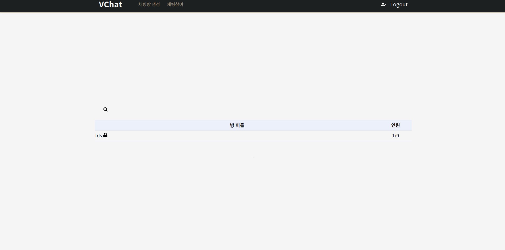
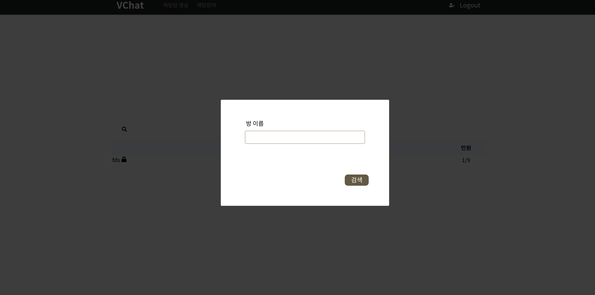
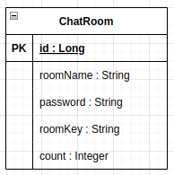
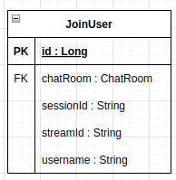
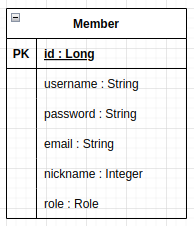
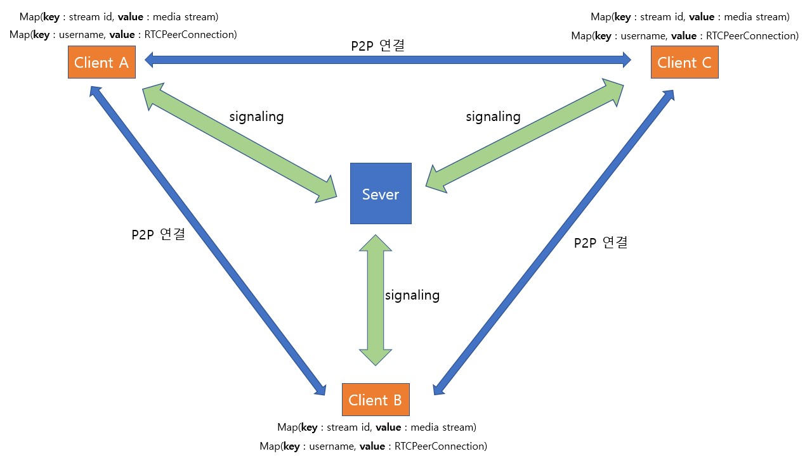

# [개인프로젝트] 화상 채팅 웹사이트
## 사용 방법
### 1.로그인
>구글, 네이버로 로그인 할 수 있습니다.

### 2.닉네임 변경
>닉네임을 변경할 수 있습니다.

### 3.채팅방 생성
>채팅방을 생성할 수 있습니다.

### 4.화상 채팅
>화상채팅을 할 수 있습니다. 
>카메라와 오디오가 없는 경우에는 일반 채팅을 통해서 대화할 수 있습니다.

### 5.채팅 참여
>현재 생성되어 있는 채팅방 목록을 확인할 수 있습니다. 
>채팅방에 비밀번호가 걸려있는 경우에는 비밀번호를 입력해야지만 입장이 가능합니다. 
>채팅방 이름을 통해 검색이 가능합니다.

## 프로젝트 구조
### 사용한 기술스택
1. Spring Boot
2. Spring Security
3. Spring Websocket(STOMP)
4. MySQL
5. JPA & QueryDSL
6. RabbitMQ
7. OAuth2.0
8. React
9. Styled Component
10. webRTC
11. Recoil
### Spring Boot
>React에서 요청한 데이터를 JSON으로 응답한다.

__구조는 다음과 같습니다.__

* config : 웹 관련 configuration을 관리합니다.
* controller : 컨트롤러를 관리합니다.
* domain : 엔티티, dto 등의 도메인을 관리합니다.
* message : STOMP와 RabbitMQ에 관련된 기능을 관리합니다.
* repository : 데이터베이스에 접근하기 위한 JPA/QueryDSL을 관리합니다.
* security : security, OAuth 관련 기능을 관리합니다.
* service : 비즈니스 로직을 관리합니다.
## Spring Security / OAuth2.0
>인가된 사용자만이 특정 리소스에 접근할 수 있도록 제한한다.

__구조는 다음과 같습니다.__

* security
  - config : Spring Security 관련 설정을 관리합니다.
    1. CORS 설정을 통해 허용된 도메인에서만 API를 호출할 수 있도록 했습니다.
    2. 인가된 사용자만이 API를 호출할 수 있도록 했습니다.
    3. OAuth 로그인을 허용했습니다.
  - member : 로그인 성공 시 반환되는 UserDetails, OAuth2User의 구현체를 관리합니다.
  - provider : OAuth 로그인 시 사용자의 프로파일 정보를 가져올 수 있는 인터페이스와 각 소셜 로그인별 구현체를 관리합니다.
### JPA / QueryDSL
>JPA와 QueryDSL을 사용하여 데이터베이스에 대한 CRUD 작업을 수행한다.  
>JPA : DB에서 데이터를 조회한다. 
>QueryDSL : JPA 만으로 처리하기 힘든 동적 쿼리는 QueryDSL로 작성한다.

__구조는 다음과 같습니다.__

* domain > entity : 엔티티를 관리한다.
  - __ChatRoom : 채팅룸 엔티티__

    

    + password는 해당 방에 입장하기 위한 패스워드입니다.
    + roomKey는 rabbitMQ의 라우팅 키입니다.
    + count는 해당 방에 입장한 인원입니다.
  - __JoinUser : 채팅룸에 참여한 유저 엔티티__

    

    + sessionID는 웹소켓 세션 아이디입니다. STOMP의 연결이 끊길 때 해당 STOMP 세션이 어떤 유저의 세션인지 구분하기 위해 사용됩니다.
    + streamId는 media stream의 id입니다. 카메라 및 오디오 권한을 거절해도 방에 참여할 수 있기 때문에 해당 값은 null이 될 수 있습니다. 사용자가 어떤 방에서 나갔을 때 해당 방에있는 다른 사용자들이 어떤 media stream을 제거해야할 지 구분하기 위해 사용됩니다.
  - __Member : 서비스에 가입한 회원 엔티티__

    
* repository
  - chatRoom
    + chatRoomRepository(JPA 인터페이스)
    + chatRoomRepositoryCustom(QueryDSL 인터페이스)
    + chatRoomRepositoryCustomImpl(QueryDSL 구현체)
  - JoinUserRepository
  - MemberRepository
### Spring WebSocket(STOMP) / RabbitMQ
>webRTC의 P2P연결을 위한 signaling server를 구축한다. 
>사용자 간에 메세지를 전달한다.

__구조는 다음과 같습니다.__

* message
  - rabbitmq
    + RabbitConfig : RabbitMQ에 대한 설정을 관리합니다.
  - websocket
    + StompHandler : 채널 인터셉터, STOMP 메세지에 대한 부가적인 로직을 수행합니다.
      1. 클라이언트의 STOMP 연결이 끊어졌을 때 해당 클라이언트가 있던 방에있는 모든 클라이언트들에게 연결이 끊어졌음을 알립니다.
      2. 클라이언트가 방에 들어온 후 MediaStream을 얻은 경우에 해당 stream의 id를 데이터베이스에 저장합니다. 
    + WebSocketConfig : 웹소켓에 대한 설정을 관리합니다.
      1. SockJS 기반으로 STOMP를 사용해 웹소켓을 지원하지 않는 브라우저도 STOMP 연결이 가능하도록 했습니다.
      2. 허용된 도메인에서만 STOMP 연결이 가능하도록 했습니다.
### React
>사용자가 서버와 상호작용할 수 있도록 한다.

__구조는 다음과 같습니다.__

* Auth : 사용자 인증과 관련된 로직 및 뷰를 관리합니다.
* chatRoom : 채팅방과 관련된 로직 및 뷰를 관리합니다.
* data : 전역적으로 사용되는 데이터를 관리합니다.
* exception : 에러 발생시 수행되는 로직을 관리합니다.
* home : 홈페이지를 관리합니다.
* modal : 재사용할 수 있도록 모듈화한 모달을 관리합니다.
* navigator : 네비게이션바를 관리합니다.
* styles : 폰트 등 스타일과 관련된 파일을 관리합니다.
### webRTC
>webRTC를 통해 P2P로 사용자 간에 화상통신이 가능하도록 한다.

__구조는 다음과 같습니다.__

* 사용자는 채팅방에 접속 시 signaling 서버를 통해 다른 사용자와 p2p 연결을 맺습니다.
* 각 사용자는 Map에 다른 사용자의 username을 key로 해서 다른 사용자와의 RTC connection을 관리합니다. 만약 다른 사용자가 방에서 나가게 되면 Map에서 해당 사용자의 username으로 RTC connection을 찾아 연결을 닫습니다.
* 각 사용자는 Map에 media stream의 id를 key로 해서 다른 사용자의 media stream을 관리합니다. 만약 다른 사용자가 방에서 나가게 되면 Map에서 해당 사용자의 media stream의 id으로 media stream을 찾아 제거합니다. 
* 각 방에는 최대 9명 까지 사용자가 접속이 가능합니다.